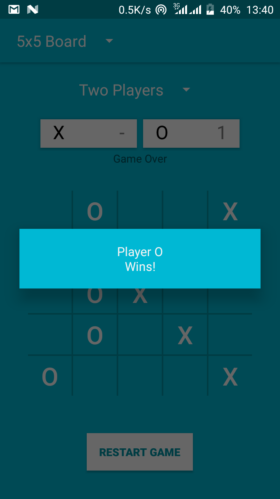
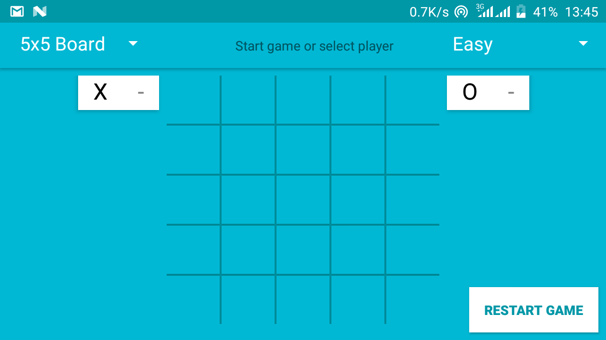

Tic Tac Toe
===================================

Single player and Two players game implemented in java. User is able to play on 3x3 or 5x5 Board

Designed as part the "Take a Climb Challenge" for the award of certificate of completion on the @Udacity, @googleafrica and @Andela course Andela Learning Community - Beginner Android Development (ALC 2.0).

Pre-requisites
--------------

- Android SDK v26
- Android Build Tools v26.0.2
- Android Support Repository v26.1.0
- Gradle 3.0.1

App Features
-------------

- Fragments
- Spinners 
- TabLayout
- ViewPager
- Dialog
- UserInteraction

Screenshots
-------------

 

Getting Started
---------------

The app uses the Gradle build system. To build this project, use the
"gradlew build" command or use "Import Project" in Android Studio.

License
-------

Copyright 2018 Zizoh James Anto

This program is free software: you can redistribute it and/or modify
    it under the terms of the GNU General Public License as published by
    the Free Software Foundation, either version 3 of the License, or
    (at your option) any later version.
    
    This program is distributed in the hope that it will be useful,
    but WITHOUT ANY WARRANTY; without even the implied warranty of
    MERCHANTABILITY or FITNESS FOR A PARTICULAR PURPOSE.  See the
    GNU General Public License for more details.
    
    You should have received a copy of the GNU General Public License
    along with this program.  If not, see <http://www.gnu.org/licenses/>.
